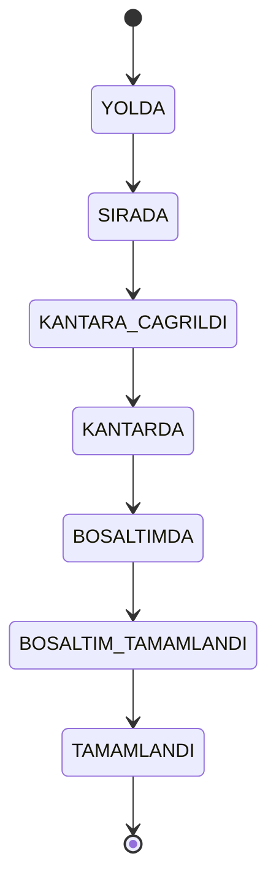

<div align="center">

# 🏭 Fabrika Hammadde Kabul ve Boşaltım Sıra Sistemi

**Hammadde taşıyan araçların fabrikaya varış, sıra alma, kantar, boşaltım ve çıkış tartımı süreçlerini uçtan uca yöneten dijital sevkiyat takip platformu.**


</div>

---

## 📑 İçindekiler

- [Genel Bakış](#-genel-bakış)
- [Özellikler](#-özellikler)
- [Teknoloji Yığını](#-teknoloji-yığını)
- [Proje Yapısı](#-proje-yapısı)
- [Sevkiyat Durum Akışı](#-sevkiyat-durum-akışı)
- [Gereksinimler](#-gereksinimler)
- [Kurulum](#-kurulum)
- [Geliştirme Admin Hesabı](#-geliştirme-admin-hesabı)
- [Demo Akışı](#-demo-akışı)
- [Kontrol Komutları](#-kontrol-komutları)
- [Notlar](#-notlar)

---

## 🎯 Genel Bakış

Sistem, üç ana uygulamadan oluşur:

| Uygulama | Kullanıcı | Görevi |
|---|---|---|
| 📱 **Mobil Uygulama** | Şoförler | Sıra alma, sevkiyat takibi, tartım sonuçlarını görüntüleme |
| 🖥️ **Admin Paneli** | Fabrika görevlileri | Kantar, boşaltım ve sevkiyat tamamlama işlemlerini yönetme |
| ⚙️ **Backend API** | Mobil ve admin | Kimlik doğrulama, iş kuralları ve veri erişimi |

---

## ✨ Özellikler

### 📱 Mobil Uygulama

- Şoför kaydı ve girişi
- Güvenli oturum saklama
- Aktif sevkiyat görüntüleme
- **“Fabrikaya Geldim”** ile sıra alma
- Sıra numarasını görüntüleme
- Sevkiyat durumunu otomatik yenilenen ekranla takip etme
- Tamamlanan işlemin **brüt, dara ve net** ağırlığını görüntüleme

### 🖥️ Admin Paneli

- Admin girişi
- Aktif sevkiyatları listeleme
- Aracı kantara çağırma
- Brüt ağırlık kaydetme
- Boşaltımı başlatma ve tamamlama
- Dara ağırlığı kaydetme
- Net teslim miktarını otomatik hesaplama
- Sevkiyatı tamamlama
- Tamamlanan işlemleri geçmiş listesinde görüntüleme

### ⚙️ Backend

- JWT tabanlı kimlik doğrulama
- `DRIVER` ve `ADMIN` rol kontrolü
- Kayıt ve giriş endpoint’leri
- Sıra numarası oluşturma
- Sevkiyat durum geçiş kontrolleri
- Brüt ve dara ağırlık doğrulamaları
- Transaction ile güvenli veritabanı işlemleri
- Mobil ve admin paneli için REST API

---

## 🧰 Teknoloji Yığını

| Katman | Teknolojiler |
|---|---|
| **Mobil** | React Native, Expo, TypeScript, React Navigation, Expo Secure Store |
| **Admin** | React, TypeScript, Vite |
| **Backend** | Node.js, Express, TypeScript, Zod, JWT, bcryptjs, mssql |
| **Veritabanı** | Microsoft SQL Server, Docker Compose |

---

## 🗂️ Proje Yapısı

```text
.
├── admin/          React admin paneli
├── backend/        Express REST API
├── database/       SQL şema ve örnek veri dosyaları
├── mobile/         Expo React Native mobil uygulaması
└── compose.yaml    SQL Server Docker servisi
```

---

## 🔄 Sevkiyat Durum Akışı



```text
YOLDA → SIRADA → KANTARA_CAGRILDI → KANTARDA → BOSALTIMDA → BOSALTIM_TAMAMLANDI → TAMAMLANDI
```

---

## 📋 Gereksinimler

Projeyi çalıştırmak için aşağıdakilerin kurulu olması gerekir:

- [Node.js](https://nodejs.org/) ve npm
- [Docker Desktop](https://www.docker.com/products/docker-desktop/)
- [Android Studio](https://developer.android.com/studio) ve Android Emulator
- [Expo Go](https://expo.dev/go)

---

## 🚀 Kurulum

> Aşağıdaki komutlar **Windows PowerShell** içindir.

### 1️⃣ Projeyi indirin

```powershell
git clone <repository-url>
cd CaseProject-SevkiyatTakipSistemi
```

### 2️⃣ Ortam değişkenlerini oluşturun

```powershell
# Kök dizin
Copy-Item .env.example .env

# Backend
Copy-Item backend\.env.example backend\.env
```

> [!IMPORTANT]
> - Kök `.env` içindeki SQL Server parolası ile `backend/.env` içindeki `DB_PASSWORD` **aynı olmalıdır**.
> - `backend/.env` içindeki `JWT_SECRET` **en az 64 karakter** olmalıdır.

### 3️⃣ SQL Server’ı başlatın

```powershell
docker compose up -d
```

Servisin çalıştığını doğrulayın:

```powershell
docker compose ps
```

### 4️⃣ Veritabanı tablolarını oluşturun

```powershell
Get-Content -Raw .\database\schema.sql | docker exec -i factory-queue-sqlserver bash -c '/opt/mssql-tools18/bin/sqlcmd -S localhost -U sa -P "$MSSQL_SA_PASSWORD" -C -i /dev/stdin'
```

### 5️⃣ Backend’i kurun ve başlatın

```powershell
cd backend
npm.cmd install
npm.cmd run dev
```

| | Adres |
|---|---|
| API | `http://localhost:3000` |
| Sağlık kontrolü | `http://localhost:3000/api/health` |

### 6️⃣ Mobil uygulamayı kurun

Yeni bir terminal açın:

```powershell
cd mobile
npm.cmd install
```

Android emülatörünü açtıktan sonra:

```powershell
npm.cmd run android
```

> [!NOTE]
> Android emülatörü, backend’e `http://10.0.2.2:3000/api` adresi üzerinden bağlanır.

### 7️⃣ İlk şoför kaydını oluşturun

Mobil uygulamadaki kayıt ekranından bir şoför hesabı oluşturun. Örnek bilgiler:

| Alan | Değer |
|---|---|
| Ad Soyad | `Demo Şoför` |
| E-posta | `driver@example.com` |
| Plaka | `34 DEMO 01` |
| Şifre | `Test12345` |

### 8️⃣ Admin ve örnek sevkiyat verisini oluşturun

Şoför kaydı tamamlandıktan sonra proje kökünde çalıştırın:

```powershell
Get-Content -Raw .\database\seed.sql | docker exec -i factory-queue-sqlserver bash -c '/opt/mssql-tools18/bin/sqlcmd -S localhost -U sa -P "$MSSQL_SA_PASSWORD" -C -i /dev/stdin'
```

Bu işlem:

- Geliştirme admin hesabını oluşturur.
- Aktif sevkiyatı olmayan şoförlere örnek sevkiyat ekler.

### 9️⃣ Admin panelini kurun ve başlatın

Yeni bir terminal açın:

```powershell
cd admin
npm.cmd install
npm.cmd run dev
```

Admin paneli: **http://localhost:5173**

---

## 🔑 Geliştirme Admin Hesabı

| Alan | Değer |
|---|---|
| E-posta | `admin@factory.local` |
| Şifre | `Admin123!` |

> [!WARNING]
> Bu hesap yalnızca **yerel geliştirme ve demo** amacıyla kullanılmalıdır. Canlı ortamda mutlaka kaldırılmalı veya değiştirilmelidir.

---

## 🎬 Demo Akışı

| # | Adım | Kim |
|---|---|---|
| 1 | Mobil uygulamadan giriş yapar | 🚚 Şoför |
| 2 | Aktif sevkiyatını görüntüler | 🚚 Şoför |
| 3 | **“Fabrikaya Geldim”** butonuna basar | 🚚 Şoför |
| 4 | Sıra numarası oluşturulur, araç admin panelinde sıraya düşer | ⚙️ Sistem |
| 5 | Aracı kantara çağırır | 🧑‍💼 Admin |
| 6 | Aracı kantara alır | 🧑‍💼 Admin |
| 7 | Brüt ağırlığı girer | 🧑‍💼 Admin |
| 8 | Boşaltımı başlatır ve tamamlar | 🧑‍💼 Admin |
| 9 | Dara ağırlığını girer | 🧑‍💼 Admin |
| 10 | Net teslim miktarı hesaplanır | ⚙️ Sistem |
| 11 | Sevkiyatı tamamlar | 🧑‍💼 Admin |
| 12 | Sonuç mobil uygulamada görüntülenir | 🚚 Şoför |
| 13 | İşlem **“Tamamlanan İşlemler”** bölümüne taşınır | 🧑‍💼 Admin |

---

## ✅ Kontrol Komutları

| Uygulama | Komut |
|---|---|
| **Backend** – TypeScript kontrolü | `cd backend` → `npm.cmd run typecheck` |
| **Mobil** – TypeScript kontrolü | `cd mobile` → `npx.cmd tsc --noEmit` |
| **Admin** – Build kontrolü | `cd admin` → `npm.cmd run build` |

---

## 📝 Notlar

- Gerçek parolalar `.env` dosyalarında tutulur.
- `.env` dosyaları Git’e eklenmez.
- Tamamlanan sevkiyatlar admin panelinde geçmiş listesinde görüntülenir.
- Mobil uygulama, sevkiyat durumunu belirli aralıklarla otomatik yeniler.
